# Home Comparison 

- [2720 Shady Branch Ln, McKinney, TX 75071](https://www.zillow.com/homedetails/2720-Shady-Branch-Ln-McKinney-TX-75071/458798695_zpid/ "https://www.zillow.com/homedetails/2720-Shady-Branch-Ln-McKinney-TX-75071/458798695_zpid/")
- [1213 Beebalm Mews, Celina, TX 75009](https://www.zillow.com/homedetails/1213-Beebalm-Mews-Celina-TX-75009/450791209_zpid/)

## Score Matrix 

[Matrix](https://docs.google.com/spreadsheets/d/1wDHrVmryF8s_1DAMIpD5JhCyhj1Z6oLasxe2rCHbRuc/edit?gid=0#gid=0)

### Finance Comparison Image

#### Price Comparison Dashboard

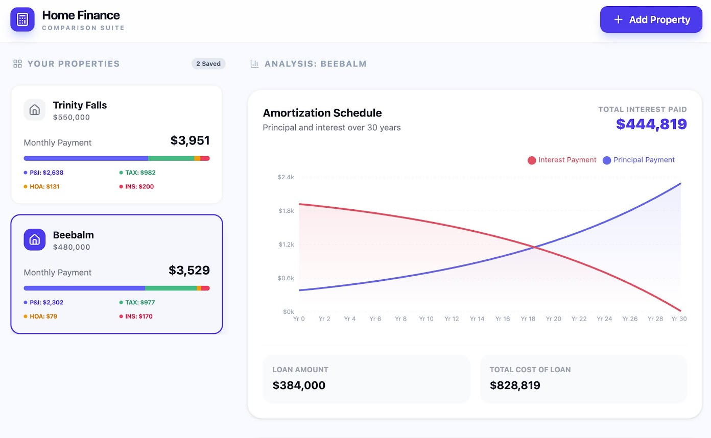

| Room | [1213 Beebalm Mews](https://www.zillow.com/homedetails/1213-Beebalm-Mews-Celina-TX-75009/450791209_zpid/) | [2720 Shady Branch Ln](https://www.zillow.com/homedetails/2720-Shady-Branch-Ln-McKinney-TX-75071/458798695_zpid/) |
| --- | --- | --- |
| Kitchen | 8 | 7 |
| Living Room | 9 | 7 |
| Entryway / Foyer | 6 | 6 |
| Primary Bedroom | 5 | 8 |
| Guest Bedroom | 5 | 6 |
| Primary Bathroom | 7 | 8 |
| Pantry | 5 | 7 |
| Home Office | 9 | 8 |
| Mudroom | 0 | 2 |
| Garage | 7 | 7 |
| BackYard | 4 | 7 |
| Front Yard | 6 | 7 |
| Media Room | 5 | 0 |
| Community | 5 | 8 |
| Price | 8 | 6 |
| School Quality | 5 | 8 |
| Future Growth | 8 | 6 |
| Amenities | 3 | 7 |
| Traffic | 3 | 6 |

## 1213 Beebalm Mews, Celina, TX 75009
- [Zillow](https://www.zillow.com/homedetails/1213-Beebalm-Mews-Celina-TX-75009/450791209_zpid/)

### Footage 
- [Album](https://photos.google.com/album/AF1QipMTMVzvvos3Sz_k1EmYOoRRt7XFS_T1G56GgLQH)

- [Outside](https://photos.app.goo.gl/QV5rjWNfByWCZFjQA)
- [Inside 1](https://photos.app.goo.gl/ZpgE8NMaa99JKYBz9)
- [Inside 2](https://photos.app.goo.gl/XVTjoBM7Bigo8iEJ6)

### Reference Images

#### Front Exterior

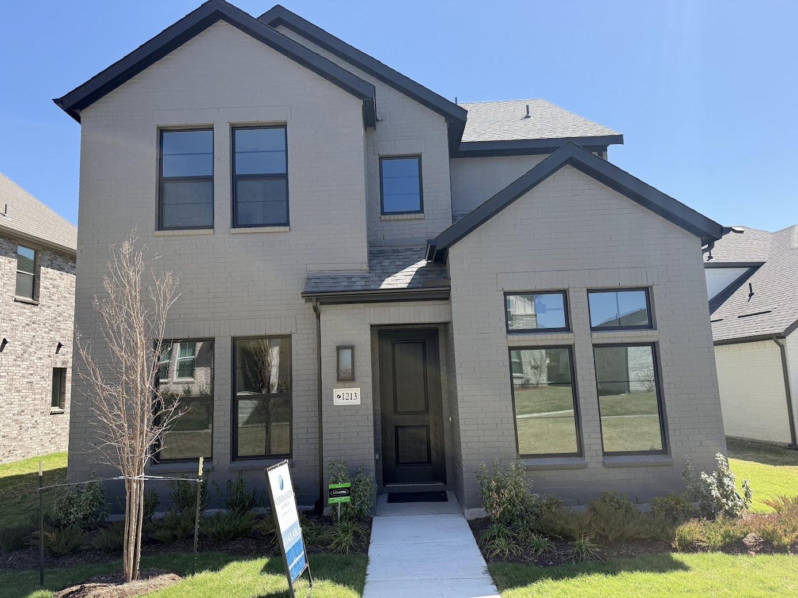

Very cute. 

#### Kitchen

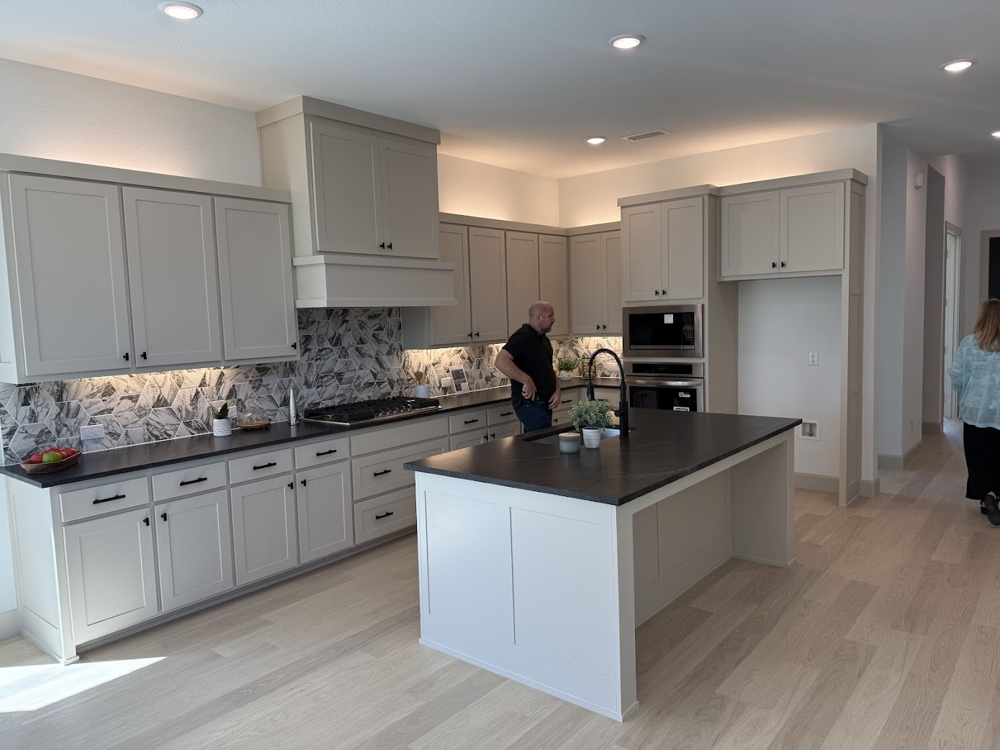

Jaw dropping. 

#### Living Room

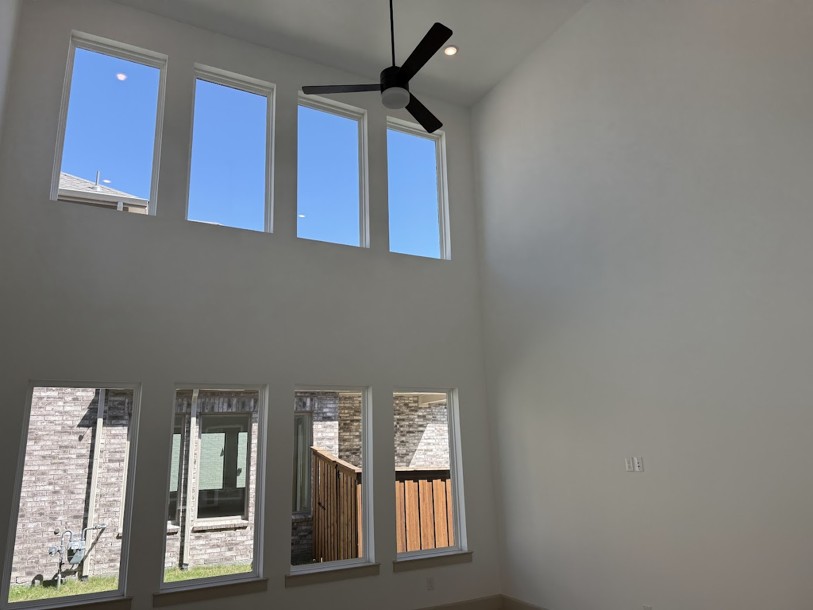

This living room is actually freaking insane. 

#### Primary Bathroom

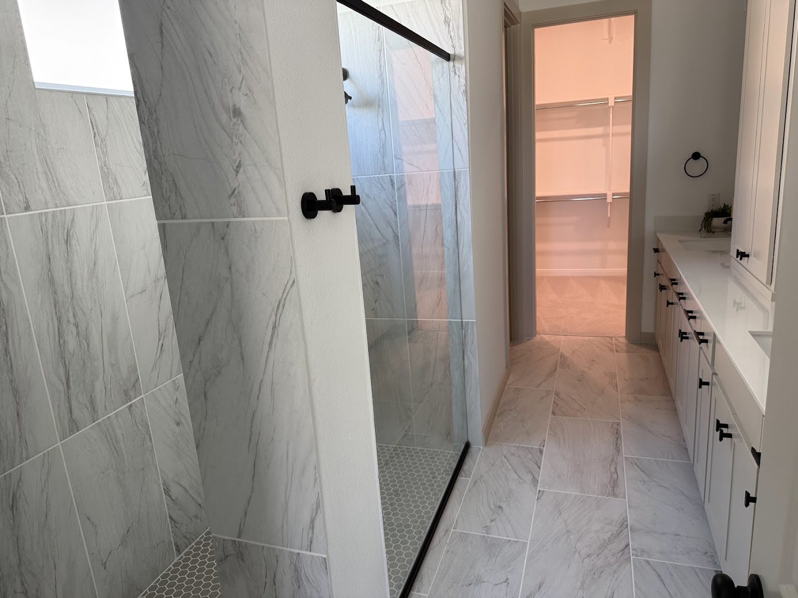

The bath here is a little weird. It has a shower only. Now, it is a very deluxe shower, which I actually like, but the bathroom itself is quite narrow and small and kind of feels cramped. Not having access to a tub is a slight disappointment. 

#### Office

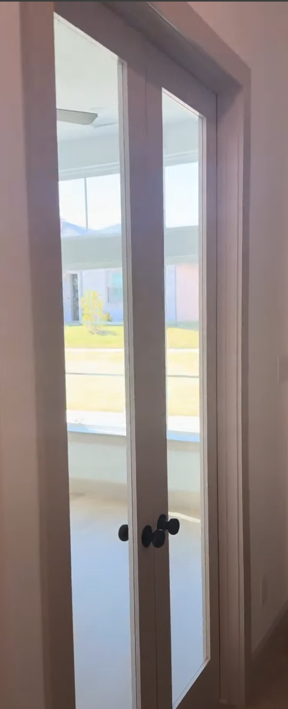

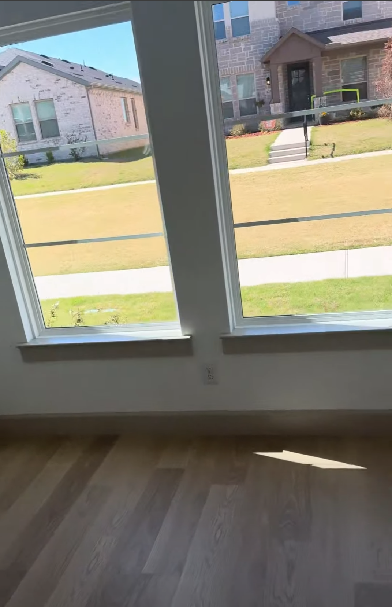

The office is kind of nuts. It actually has a fan as well and has a cute little view to the front of the home. 

The double glass doors entering the office feel super luxe. 

### 'Doctor Doctor, give me the "Mews"'

The Mews designation here is meaningful and quite unusual. The front of the home has no road and instead it's a walkable area with just the fronts of homes facing the walkway. It looks very picturesque and walkable and it has trees in the middle and greenery that's maintained by the HOA. This is interesting. It is somewhat pleasant but it's also unusual because:

1. Unless somebody parks on the side of the road and walks over, nobody's ever going to see the front of my house. They're going to pull up in the back and go into the driveway.
2. There is a question mark around making this confusing for delivery drivers and potentially others coming to visit my home.
   
   
One also has to wonder if resale value could be impacted by this if some might not find this an attractive feature. For the record I think it's quite charming; however I can see it potentially being an issue. 

### Celina as a developing region

This home is in Celina, which features a more in-development area. This is both good and bad.

Bad:
1. Construction is everywhere. This is going to cause headaches for a while.
2. The tollway to access this area easily is still under development and constantly expanding north. It's accessed by the Dallas North Tollway. Over the next few years you're going to see that complete, which will both ease traffic but then also increase demand for this area, which will undoubtedly lead to more traffic. It's really unclear how traffic will shake out in this area.
3. Celina is not as high quality as McKinney ISD.
4. There's not really much in terms of food in the immediate area. I'm probably driving into Prosper or even into Frisco for food.

Good: 
1. Construction is a good sign for future growth. Undoubtedly this can lead to improved value in the future for those who are willing to take the risk.
2. I do believe that the potential of this area is very high in the far future. It is slightly closer to Frisco, which is a potential benefit.

### Final Thoughts 

I like this home the best; however I like the area a lot less. This home has a really nice office. It has really great style and it has a jaw-dropping living room and kitchen. The master bedroom and the master bathroom are slightly disappointing. The backyard is also fairly weak and not as private as I might like.

## 2720 Shady Branch Ln, McKinney, TX 75071
- [Zillow](https://www.zillow.com/homedetails/2720-Shady-Branch-Ln-McKinney-TX-75071/458798695_zpid/ "https://www.zillow.com/homedetails/2720-Shady-Branch-Ln-McKinney-TX-75071/458798695_zpid/")

### Footage 
- [Album](https://photos.app.goo.gl/XYk2HJDEmaGYBXKa7)
- [Inside and Back](https://photos.app.goo.gl/sxx4jtnpbUGUFb6u9) 

### Reference Images

#### Front Exterior

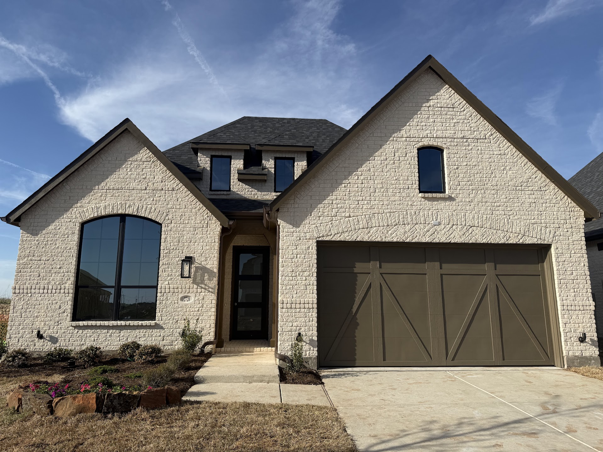

Very snazzy. 

#### Kitchen

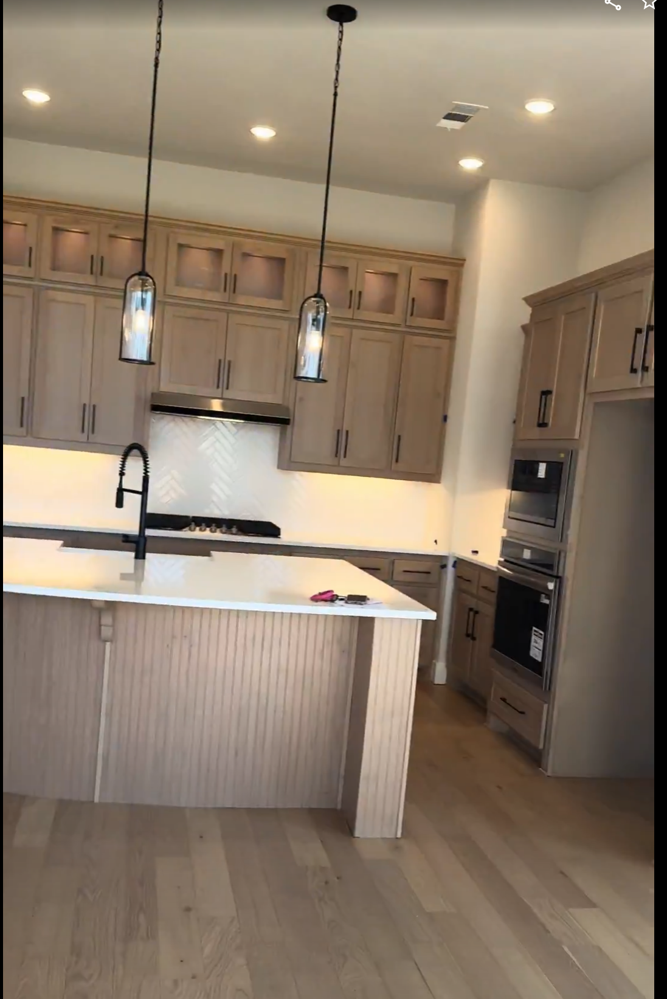

The workable area in the kitchen is slightly smaller than Beebalm. 

The cabinets seem incredibly high quality, and the drawers pull all the way out. It feels very ritzy. The island is also very beautiful, and the kitchen sink feels very luxe. 

Note the little cabinets above the main cabinets. Those are for housing decorations like pots or ferns or whatever. I'm going to need to do some interior decorating here. 

#### Living Room

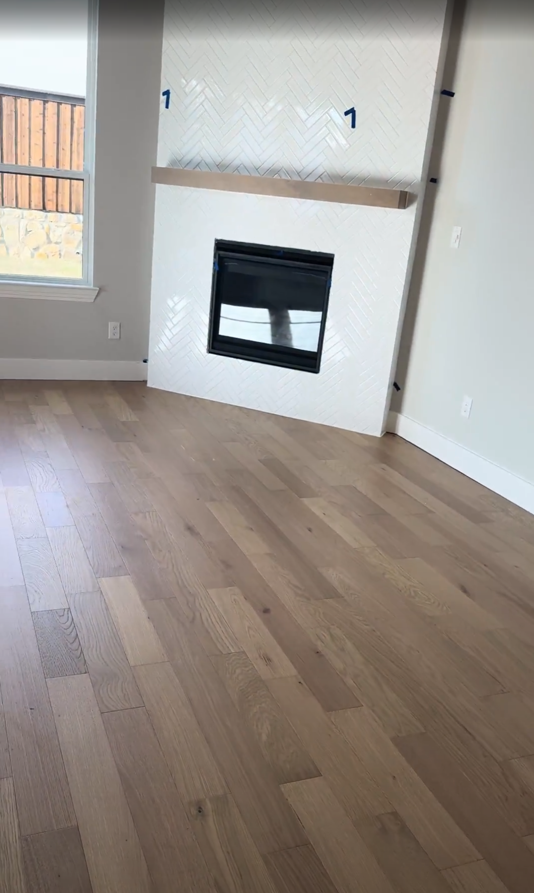

One of the rare homes I have seen that has a fireplace that is actually done well. The fireplace is off to the side, and the living room is constructed in such a way that there's plenty of space to have the TV to the side of the fireplace at a level that is appropriate. 

#### Primary Bathroom

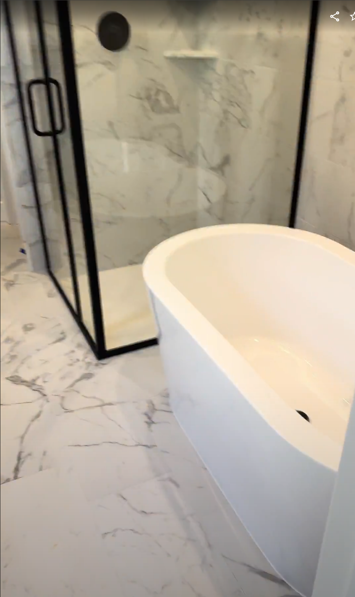

#### Office View

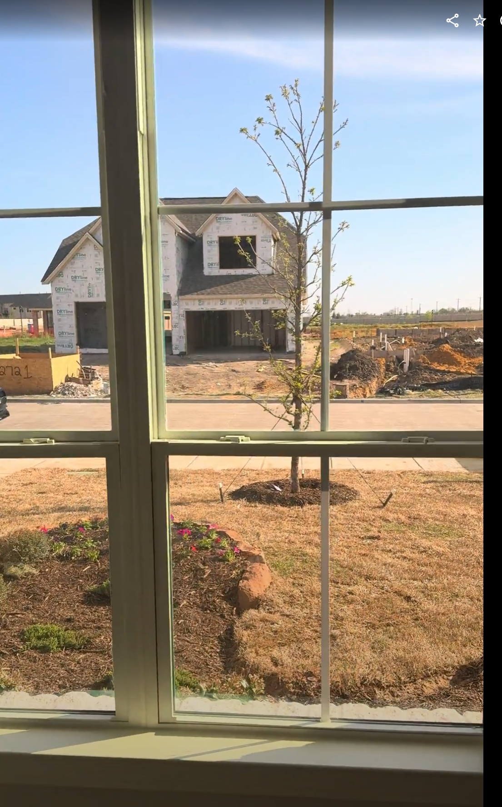

Double-door entry to the office, but they're not glass doors. Also, there's no fan in the office. Confusingly, there's also no Ethernet port. I need to speak with them more about this, as this may cause issues. 

### Back Yard Notes 

The backyard is actually relatively private, which is incredibly rare. It also features a gas line out to the patio so that I can hook up a gas grill directly. 

### Quick Thoughts 

More active construction, a significantly better community. Arguably even better view out of the office. Slightly worse office doors and no fan in the office. 

### Highland Homes 

This home is built by Highland Homes, who arguably is regarded as the highest quality builder in the area. This is essentially the top-of-the-line builder, and with it comes a premium, both in terms of materials and quality, but also in terms of cost. You are getting a really high seal of quality with this purchase.

They do a lot more expensive land certification type activities, and more expensive insulation is used than in typical homes. They have a better foundation, they claim, than most builders. A lot of this stuff, to be honest, is a bit over my head, but I can appreciate foundational quality. 

### 404 - Internet Not Found 

As this section of Trinity Falls that I'm moving into is currently being built, hilariously there is actually no internet available, but that is going to be very quickly changed. Kind of funny, so I might have to use a crappy AT&T wireless internet until maybe a few months after move-in and the build out of fiber cable is complete in this area. 

### Trinity Falls 

This home is a part of the Trinity Falls community, which is an actual community with some proper community features and an emphasis on lakes and nature and a lot more walkability, although it is a fairly large community still. There are running trails, hiking trails, catch-and-release ponds, community events, etc. 

[https://www.trinityfalls.com/](https://www.trinityfalls.com/) 

My aspiration is that the Trinity Falls environment will help me to be a little bit more active and a little less of a homebody. 

### Final Thoughts 

This home has the better master bath and master bedroom and also has higher quality materials and a better community; however, it also has slightly fewer features. Overall I like the home slightly less even though it is high quality and I like the area a lot more. 
